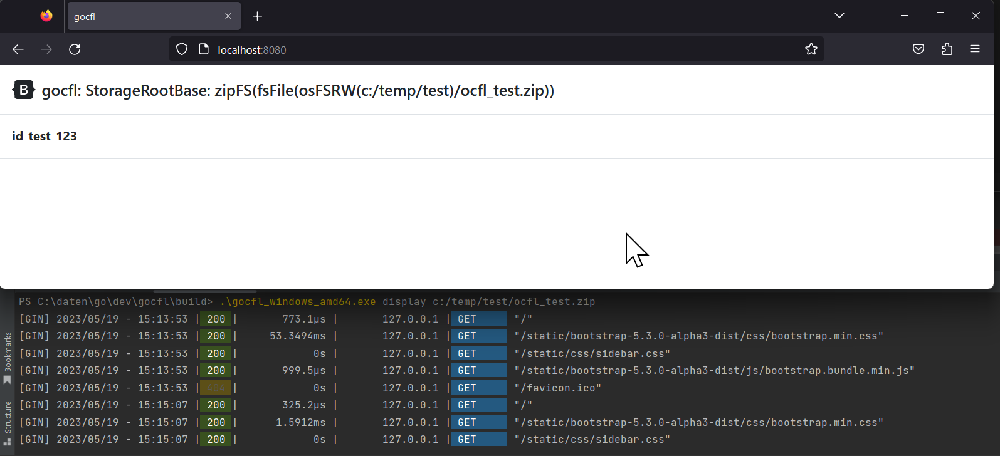
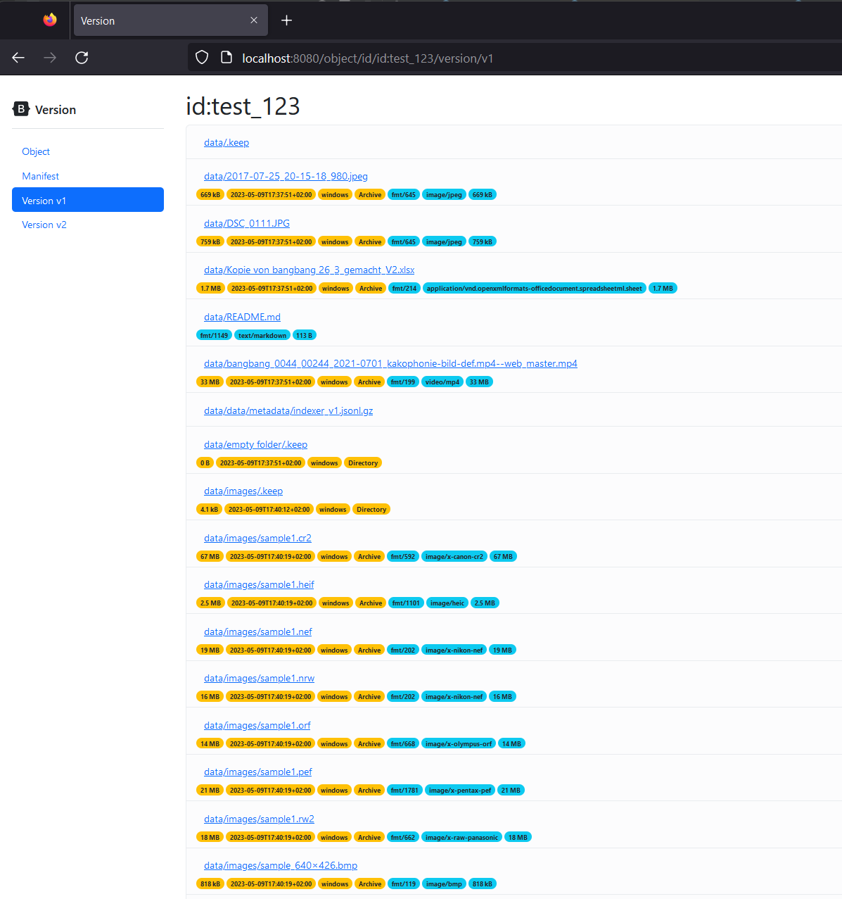
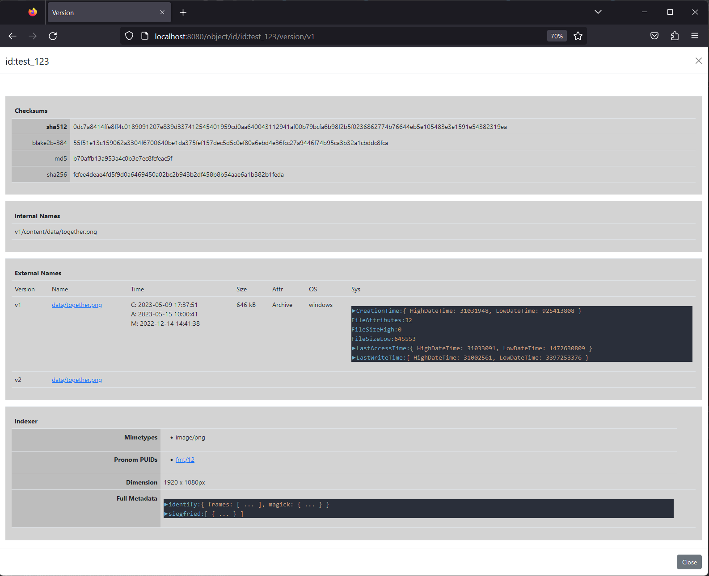

# Display

Displays content of OCFL object in a webbrowser

This functionality has been implemented mainly for debugging purposes.
It's not for large Storage Roots or large Objects (several hundreds of thousands elements)

```
Usage:
  gocfl display [path to ocfl structure] [flags]

Aliases:
  display, viewer

Examples:
gocfl display ./archive.zip

Flags:
  -a, --display-addr string            address to listen on (default "localhost:8080")
  -e, --display-external-addr string   external address to access the server (default "http://localhost:8080")
  -t, --display-templates string       path to templates
  -h, --help                           help for display

Global Flags:
      --config string                 config file (default is $HOME/.gocfl.toml)
      --log-file string               log output file (default is console)
      --log-level string              log level (CRITICAL|ERROR|WARNING|NOTICE|INFO|DEBUG) (default "ERROR")
      --s3-access-key-id string       Access Key ID for S3 Buckets
      --s3-endpoint string            Endpoint for S3 Buckets
      --s3-region string              Region for S3 Access
      --s3-secret-access-key string   Secret Access Key for S3 Buckets
      --with-indexer                  starts indexer as a local service
```

## Examples

```
PS C:\daten\go\dev\gocfl\build> .\gocfl_windows_amd64.exe display c:/temp/test/ocfl_test.zip
[GIN] 2023/05/19 - 15:13:53 | 200 |       773.1µs |       127.0.0.1 | GET      "/"
[GIN] 2023/05/19 - 15:13:53 | 200 |     53.3494ms |       127.0.0.1 | GET      "/static/bootstrap-5.3.0-alpha3-dist/css/bootstrap.min.css"
[GIN] 2023/05/19 - 15:13:53 | 200 |            0s |       127.0.0.1 | GET      "/static/css/sidebar.css"
[GIN] 2023/05/19 - 15:13:53 | 200 |       999.5µs |       127.0.0.1 | GET      "/static/bootstrap-5.3.0-alpha3-dist/js/bootstrap.bundle.min.js"
[GIN] 2023/05/19 - 15:13:53 | 404 |            0s |       127.0.0.1 | GET      "/favicon.ico"
```
### Storage Root



### Object Overview


### Version


### File Detail
