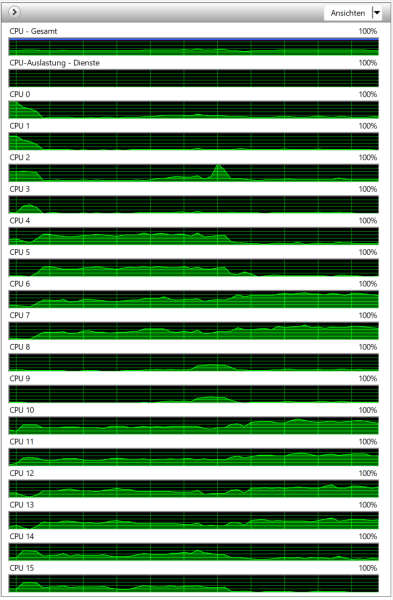
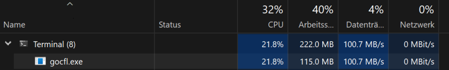

# Facts & Figures for large object example

A complete digital museal exhibition will be used as large test object. 
The Exhibition contains mainly of PNG images and H.264 movies. This means, that there's no
space for good compression in a ZIP file.

```
Size:         326 GB (350’808’857’649 Bytes)
Size on Disk: 326 GB (350’996’570’112 Bytes)
Content:      91’774 Files, 5’842 Folder
```

## Device for testing
```
Lenovo Laptop
Processor:        11th Gen Intel(R) Core(TM) i7-11850H @ 2.50GHz   2.50 GHz
Memory:           64.0 GB
Operating System: Windows 11 Pro
OS Version:       22H2
Disk:             SSD
```

## Ingest

### Command
```
gocfl. exe create C:/temp/ocfl_create.zip C:/temp/bangbang metadata:C:/temp/standorte --config ./config/gocfl.toml -i "id:blah-blubb" --ext-NNNN-metafile-source "file:///C:/temp/WhatsApp Bild 2022-12-11 um 15.25.47.jpg"
```
This command will result in a ZIP File and an encrypted ZIP File. Both files will have a sidecar 
with SHA512 checksum and there will be one sidecar file with encryption key and one with encryption
initialisation vector (both hex encoded).

It generates six checksums
* SHA512 for Manifest
* MD5, SHA256, BLAKE2b-384 for Fixity
* SHA512 for ZIP File
* SHA512 for encrypted ZIP File

and encrypts the emerging ZIP with AES256 concurrently

The extension `NNNN-content-subpath` allows the integration of subfolders in the content area. 
Content will move to a `content` subfolder and data from `C:/temp/standorte` will 
appear in the `metadata` subfolder.  

With die extension `NNNN-metadata` the additional file 
`file:///C:/temp/WhatsApp Bild 2022-12-11 um 15.25.47.jpg` will be added to the extension folder.


### [Config File](largeobject.toml)

### Extensions

The [default extensions](../data/defaultextensions) for Storage Root and Objects are used in this case.

#### Ressource Usage

CPU Usage distributes nicely over the different CPU Cores. Six cores have more load because of the 
checksum generation.  


Disk I/O is quite bad on this laptop, but it is clear, that CPU is not the limiting factor on
ingest.


## Result

```
Mode                 LastWriteTime         Length Name
----                 -------------         ------ ----
-a---          06.01.2023    13:24   347890195902 ocfl_create.zip
-a---          06.01.2023    13:24   347890192178 ocfl_create.zip.aes
-a---          06.01.2023    13:24             32 ocfl_create.zip.aes.iv
-a---          06.01.2023    13:24             64 ocfl_create.zip.aes.key
-a---          06.01.2023    13:24            150 ocfl_create.zip.aes.sha512
-a---          06.01.2023    13:24            146 ocfl_create.zip.sha512
```

## Content Information
```
PS C:\daten\go\dev\gocfl> ../bin/gocfl.exe info /temp/ocfl_create.zip --stat-info objects --stat-info objectversions
error reading config file : Config File ".gocfl" Not Found in "[C:\\daten\\go\\dev\\gocfl C:\\Users\\micro]"
Storage Root
OCFL Version: 1.1
Object Folders: id=u003Ablah-blubb
Object: id=u003Ablah-blubb
[id:blah-blubb] Digest: sha512
[id:blah-blubb] Head: v1
[id:blah-blubb] Manifest: 91777 files (76578 unique files)
[id:blah-blubb] Version v1
[id:blah-blubb]     User: Jürgen Enge (mailto:juergen@info-age.net)
[id:blah-blubb]     Created: 2023-01-06 10:15:43 +0100 CET
[id:blah-blubb]     Message: Initial commit

[object 'zipfs://id=u003Ablah-blubb' - '']
   #W013 - ‘In an OCFL Object, extension sub-directories SHOULD be named according to a registered extension name.’ [unknown extension in folder 'zipfs://extensions/NNNN-content-subpath']

no errors found
```

## Content Validation
Internal OCFL Validation has to read the whole storage root and calculate manifest and fixity
checksums.  Therefor more ressources are needed. 

Internal integrity check
```
PS C:\daten\go\dev\gocfl> ../bin/gocfl.exe validate /temp/ocfl_create.zip
error reading config file : Config File ".gocfl" Not Found in "[C:\\daten\\go\\dev\\gocfl C:\\Users\\micro]"
object folder 'id=u003Ablah-blubb'

[object 'zipfs://id=u003Ablah-blubb' - '']
   #W013 - ‘In an OCFL Object, extension sub-directories SHOULD be named according to a registered extension name.’ [unknown extension in folder 'zipfs://extensions/NNNN-content-subpath']

no errors found
```

