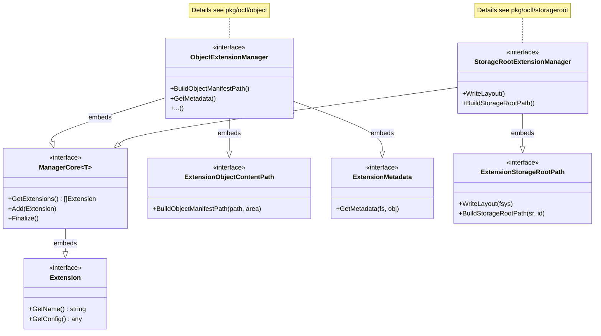

# Extension Architecture

This documentation describes the architecture of the extension system in `gocfl`. The system is designed to modularly extend the functionality of OCFL objects and Storage Roots.

## Class Diagram of the ExtensionManager

The `ExtensionManager` is the central orchestrator for all extensions. There are specialized managers for objects and Storage Roots, each supporting different sets of interfaces.

## Core Components

- **Extension**: The base interface for all extensions. Every extension has a name and a configuration.
- **ManagerCore**: Defines the basic functions for managing a collection of extensions (adding, listing, initializing).
- **ExtensionManager (Object)**: Combines interfaces relevant for the manipulation and querying of OCFL objects (e.g., path mapping, metadata extraction).
- **ExtensionManager (Storage Root)**: Combines interfaces for managing the Storage Root, in particular the Storage Layout.

## Specialized Interfaces (Examples)

- **ExtensionObjectContentPath**: Allows extensions to influence the physical paths within an object.
- **ExtensionMetadata**: Enables the collection of additional metadata during object operations.
- **ExtensionStorageRootPath**: Defines how object IDs are mapped to directories in the Storage Root.

Detailed information on integration can be found in the [**Object Architecture**](../../object/docs/architecture.md) and the [**Storage Root Architecture**](../../storageroot/docs/architecture.md).

For details on how extensions are registered and how the factory is initialized, see the [**Init Factory Sequence Diagram**](initfactory.md) and the [**Init Manager Sequence Diagram**](initmanager.md).
