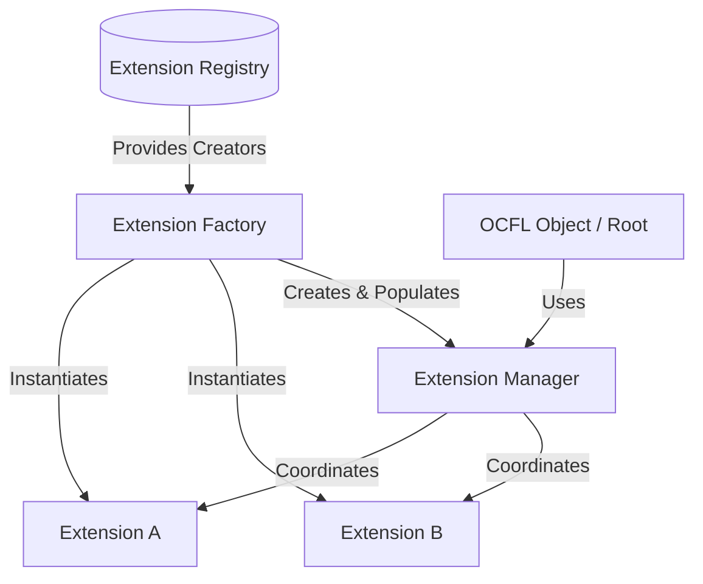

# Extension System Architecture

The OCFL extension system in this library is built around three core concepts: the **Extension**, the **Manager**, and the **Factory**.

## Overview

### 1. The Extension (The Worker)
An [**Extension**](EXTENSION.md) is a self-contained unit of logic. It knows how to do one specific thing (e.g., hash a file, map a path, or store metadata). It is passive and waits to be called.

### 2. The Manager (The Orchestrator)
The [**Manager**](MANAGER.md) is the central coordinator. It holds a collection of Extensions and knows when to call which one.
- It provides a unified interface for the OCFL Object or Storage Root.
- It handles the order of extensions.
- It manages the persistence of all extension configurations.

### 3. The Factory (The Creator)
The [**Factory**](FACTORY.md) is the bootstrapping mechanism.
- It maintains a registry of all available extension implementations.
- It translates names (from OCFL configuration files) into Go objects.
- It creates the Manager and fills it with the necessary Extension instances.

## Workflow Example: Loading an Object

1. The **Object Loader** encounters an `extensions/` directory.
2. It asks the **Factory** to `LoadExtensionManager(fsys)`.
3. The **Factory** reads the `extensions/` directory:
   - It finds the `initial` extension to determine which Manager type to use.
   - It iterates through all other subdirectories.
   - For each subdirectory, it looks up the extension name in its registry.
   - It creates an instance of the `Extension` and loads its `config.json`.
4. The **Factory** creates the **Manager** instance, adds all loaded **Extensions** to it, and returns it to the Loader.
5. The **Object** now uses this **Manager** for all subsequent operations.

## Summary of Differences

| Component | Responsibility | Analog |
| :--- | :--- | :--- |
| **Extension** | Functional Logic | Tools in a toolbox |
| **Manager** | Coordination & State | The craftsman using the tools |
| **Factory** | Discovery & Creation | The tool shop where you buy/order tools |
