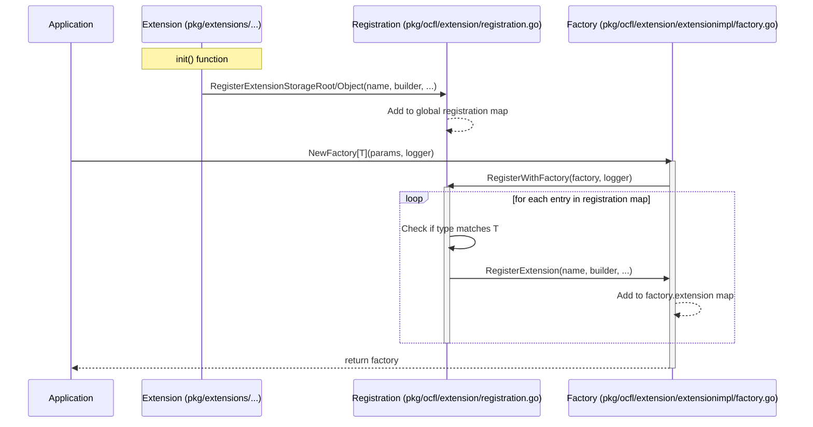

# Factory Initialization and Extension Registration Sequence Diagram

This diagram shows how extensions register themselves and how the `Factory` is initialized, collecting these registrations.

## Description

1.  **Self-Registration**: Each extension in `pkg/extensions/...` has an `init()` function that calls `extension.RegisterExtensionStorageRoot` or `extension.RegisterExtensionObject`. These functions add the extension's builder to a global map in the `registration.go` file.
2.  **Factory Creation**: When the application creates a new factory using `extensionimpl.NewFactory[T]`, the factory calls `extension.RegisterWithFactory`.
3.  **Registration Transfer**: `RegisterWithFactory` iterates over the global registration map and calls `RegisterExtension` on the factory instance for each extension that matches the requested manager type `T`.
4.  **Ready for Use**: The factory instance now contains all relevant extensions and can be used to load extensions from configurations or files.
