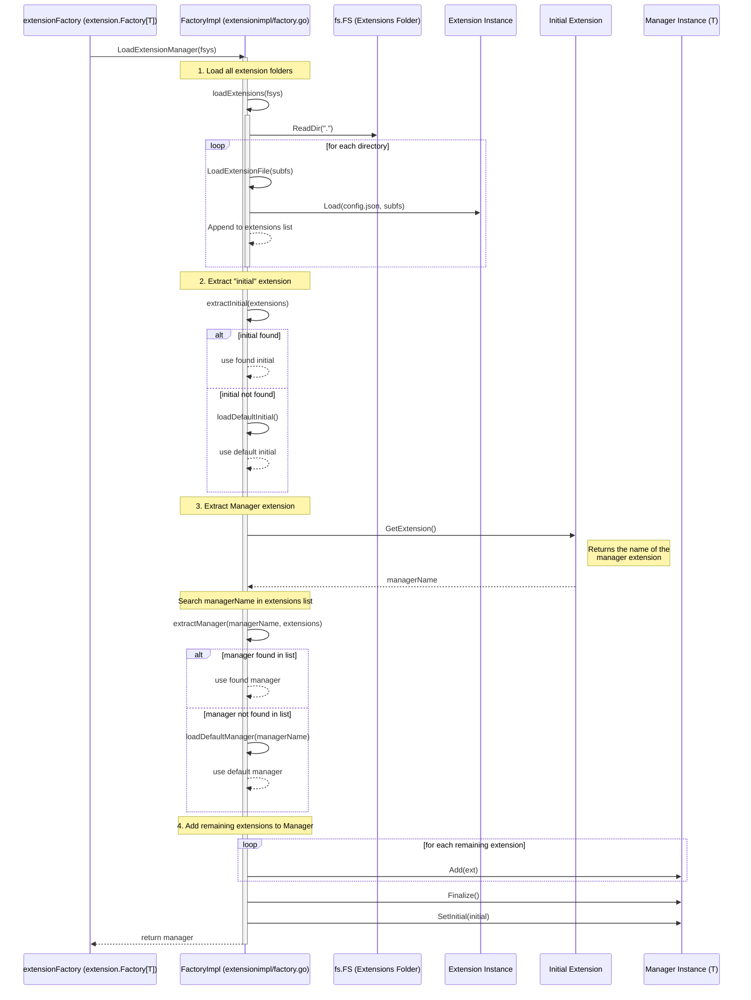

# Extension Manager Initialization Sequence Diagram

This diagram shows how the `Factory` loads an `ExtensionManager` from a filesystem (typically the `extensions` folder in an OCFL object or storage root), including the iteration over the filesystem and the resolution of the manager and its extensions.

## Description

0.  **Entry Point**: Der Aufrufer (z.B. ein `Loader` für ein OCFL Objekt) ruft `extensionFactory.LoadExtensionManager` mit dem `extensions` Unterdateisystem auf.
1.  **Iterate Filesystem**: Die Methode `loadExtensions` liest das bereitgestellte Dateisystem (normalerweise das `extensions` Verzeichnis). Für jedes Unterverzeichnis wird versucht, eine Extension mittels `LoadExtensionFile` zu laden, welche die `config.json` in diesem Verzeichnis liest.
2.  **Initial Extension**: The system looks for an extension named `initial`. This extension (defined in OCFL) specifies which manager should be used (it contains the extension name of the manager). If not present, a default initial configuration is used.
3.  **Manager Selection**: Based on the name provided by the `initial` extension (via `initial.GetExtension()`), the factory searches for this name within the list of already loaded extensions (`extractManager`). If a matching extension is found, it is used as the "Manager". This manager will hold and coordinate all other extensions. If no such extension is found in the filesystem, a default manager of that name is created.
4.  **Assembly**: All other loaded extensions are added to the manager via its `Add` method. Finally, the manager is finalized and returned to the application.
