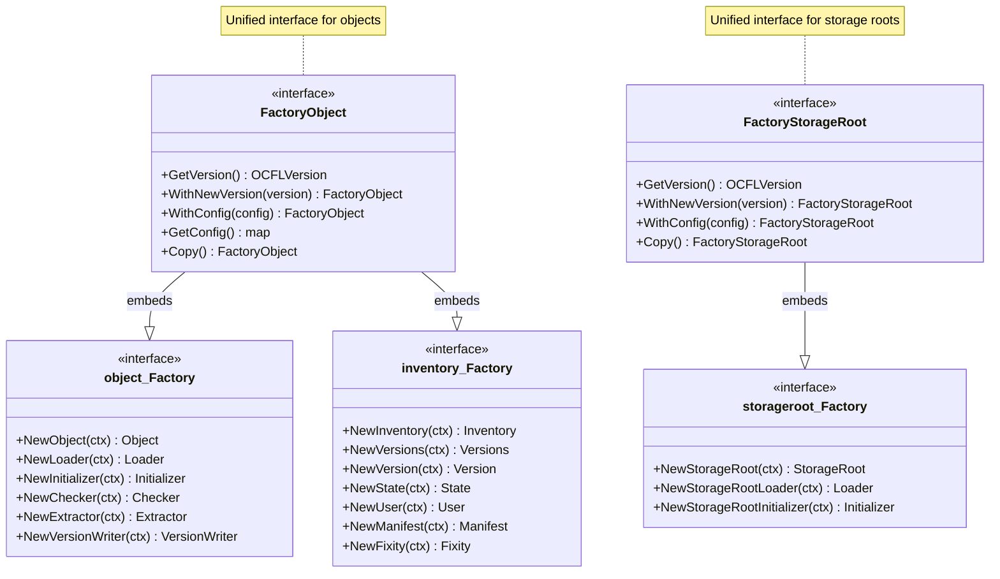

# Factory Architecture

Das `factory`-Paket bietet vereinheitlichte Schnittstellen für die Erstellung von OCFL-Objekten und Storage-Roots. Es fungiert als Fassade, die Sub-Factories aus verschiedenen OCFL-Komponenten (Object, Inventory, StorageRoot) zu einem einzigen, kohärenten Interface kombiniert.

## Klassendiagramm

Das folgende Diagramm zeigt die Beziehung zwischen den zentralen Factory-Interfaces und ihren Implementierungen sowie die Einbindung der Sub-Factories.



## Kernkomponenten

### Unified Factory Interfaces

- **FactoryObject**: Das zentrale Interface für alles, was mit OCFL-Objekten zu tun hat. Es bündelt Methoden zur Erstellung von:
    - **Object-Komponenten** (`object.Factory`): 
        - `NewObject`: Erstellt eine Instanz eines OCFL-Objekts.
        - `NewLoader`: Erstellt einen Loader zum Einlesen bestehender Objekte.
        - `NewInitializer`: Initialisiert neue OCFL-Objekte.
        - `NewChecker`: Validiert Objekte.
        - `NewExtractor`: Extrahiert Inhalte.
        - `NewVersionWriter`: Schreibt neue Versionen.
    - **Inventory-Komponenten** (`inventory.Factory`):
        - `NewInventory`: Erstellt ein neues Inventory-Objekt.
        - `NewFixity`, `NewManifest`, `NewVersions`, `NewState`, `NewUser`: Erstellen spezialisierte Bestandteile des Inventories.
    - **Version-Management**: Ermöglicht den Zugriff auf die OCFL-Version (`GetVersion`) und den Wechsel dieser (`WithNewVersion`).

- **FactoryStorageRoot**: Das Interface für die Verwaltung von Storage-Roots. Es bündelt Methoden zur Erstellung von:
    - **StorageRoot-Komponenten** (`storageroot.Factory`):
        - `NewStorageRoot`: Erstellt eine Instanz einer OCFL Storage Root.
        - `NewStorageRootLoader`: Erstellt einen Loader für die Storage Root.
        - `NewStorageRootInitializer`: Initialisiert eine neue Storage Root.
    - **Version-Management**: Analog zu `FactoryObject`.

### Implementierungen (`factoryimpl`)

Die Implementierungen im Paket `factoryimpl` (wie `FactoryBaseObject`) sind dafür verantwortlich, die konkreten Instanzen der Komponenten zu erzeugen. Dabei nutzen sie oft die Konfiguration (`config`) und die `extension.Factory`, um spezialisierte Objekte zu instanziieren.

Beispiel `FactoryBaseObject.NewLoader`:
```go
func (f *FactoryBaseObject) NewLoader(ctx context.Context) object.Loader {
    return objectimpl.NewLoader(ctx, f.factory, f.config[object.LoaderName], f.logger)
}
```

## Design-Prinzipien

1. **Abstraktion**: Die Factory verbirgt die Komplexität der Initialisierung einzelner Komponenten (z.B. welche `objectimpl`-Klasse für welche Version genutzt wird).
2. **Erweiterbarkeit**: Über Konfigurations-Maps können der Factory spezifische Parameter für die zu erzeugenden Komponenten mitgegeben werden.
3. **Typisierung**: Durch die Einbettung der Sub-Factory-Interfaces (`object.Factory`, `inventory.Factory`) bleibt die Typsicherheit über Pakethierarchien hinweg erhalten.

Detaillierte Informationen zur Erweiterbarkeit finden sich in der [**Extension Architecture**](../../extension/docs/ARCHITECTURE.md).

Informationen zur Initialisierung der Factory finden sich in den Sequenzdiagrammen für [**Factory Object**](initfactoryobject.md) und [**Factory Storage Root**](initfactorystorageroot.md).
