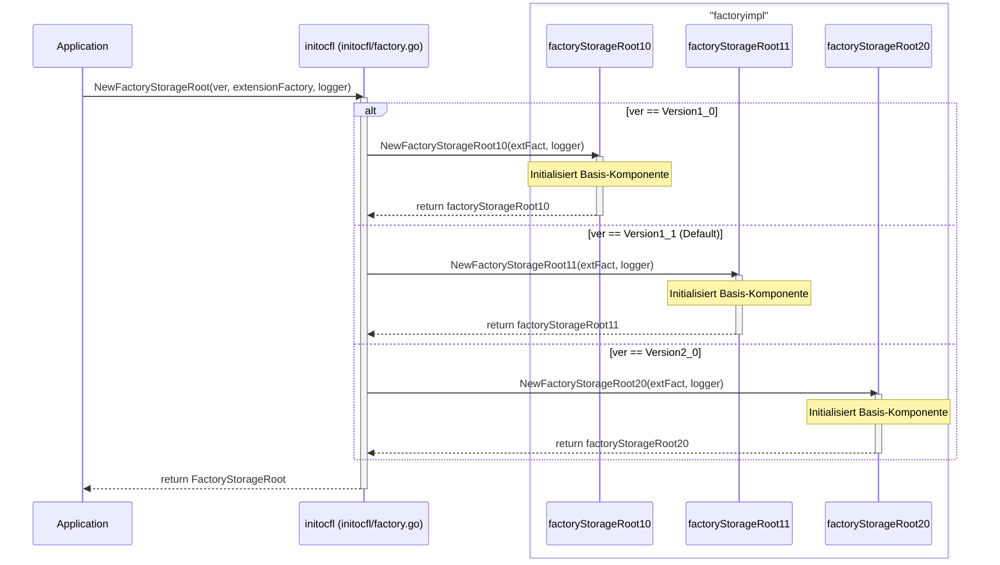

# Factory Storage Root Initialization Sequence Diagram

Dieses Dokument beschreibt den Initialisierungsprozess der Unified Factory für Storage Roots.

## NewFactoryStorageRoot Sequence Diagram

Das folgende Diagramm zeigt den Ablauf beim Aufruf von `initocfl.NewFactoryStorageRoot` für alle unterstützten Versionen.

## Beschreibung

1.  **Entry Point**: Die Anwendung ruft `initocfl.NewFactoryStorageRoot` auf. Dabei werden die gewünschte OCFL-Version, eine `extension.Factory` für Storage Roots und ein Logger übergeben.
2.  **Version Dispatch**: Basierend auf der übergebenen Version delegiert `initocfl` den Aufruf an eine spezifische Implementierungsfunktion im Paket `factoryimpl` (z. B. `NewFactoryStorageRoot11` für Version 1.1).
3.  **Base Initialization**: Die spezifische Implementierung initialisiert die Basis-Komponente (via `NewFactoryBaseStorageRoot`).
4.  **Composition**: Die Basis-Komponente wird in ein versionsspezifisches Struct eingebettet, das das Unified Interface `FactoryStorageRoot` implementiert.
