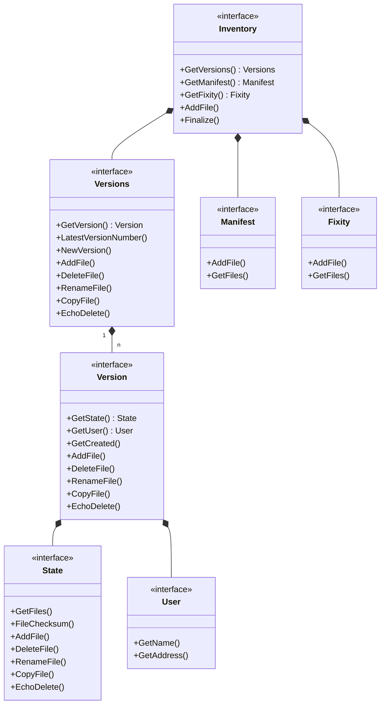

# Inventory Architecture

This documentation describes the architecture of the interfaces in the `pkg/ocfl/inventory` package. The implementation follows the hierarchical structure of the OCFL specification and uses Go interfaces for a clear separation of concerns.

## Class Diagram

The following diagram shows the relationships between the central interfaces and how they are connected through composition and embedding.

## Explanation of Components

- **Inventory**: The main interface representing the entire OCFL inventory content.
- **Versions**: Manages the history of all versions of the object and provides file operations.
- **Version**: Represents a specific version with metadata (User, Message, Created), a state (State), and supports file operations.
- **Manifest**: Maps digests to physical paths (content of the object).
- **State**: Maps logical paths of a version to digests and supports file operations.
- **Fixity**: Contains optional additional checksums for physical files.

A detailed diagram of the high-level object structure and the operational interfaces can be found in the [**Object Architecture Documentation**](../../object/docs/architecture.md). Repository-wide management is explained in the [**Storage Root Architecture Documentation**](../../storageroot/docs/architecture.md).
