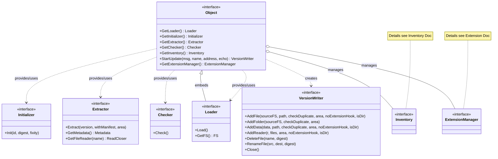

# Object Architecture

This documentation describes the architecture of the interfaces in the `pkg/ocfl/object` package. Unlike the `inventory` package, which primarily maps the data structures of the OCFL specification, the `object` package focuses on the orchestration and execution of operations on OCFL objects.

## Class Diagram

The following diagram shows the central `Object` interface and its relationship to the specialized functional modules, as well as the connection to the `inventory`.

## Explanation of Components

- **Object**: The central interface and entry point for all operations on an OCFL object. It acts as an orchestrator for specialized components.
- **Loader**: Responsible for loading an existing object from the filesystem. See [**Load Sequence**](load_sequence.md) for details.
- **Initializer**: Handles the initial creation of a new OCFL object. See [**Creation Sequence**](create_sequence.md) for details.
- **Extractor**: Enables access to content and metadata of specific versions.
- **VersionWriter**: Encapsulates the logic for write operations and creating new versions. See [**Creation Sequence**](create_sequence.md) or [**Update Sequence**](update_sequence.md) for the operational flow.
- **Checker**: Validates the object against the OCFL specification.
- **ExtensionManager**: Manages the extensions relevant to the object. Details can be found in the [**Extension Architecture Documentation**](../../extension/docs/architecture.md).
- **Inventory**: Represents the state and metadata of the object according to the OCFL standard.

## Connection to the Inventory

The `object` package makes extensive use of the `inventory` package to persist and read the state of the object. While the `inventory` defines the data structure, the `object` package implements the high-level logic.

A detailed diagram of the inventory structure can be found in the [**Inventory Architecture Documentation**](../../inventory/docs/architecture.md). The high-level container structure is described in the [**Storage Root Architecture Documentation**](../../storageroot/docs/architecture.md).
