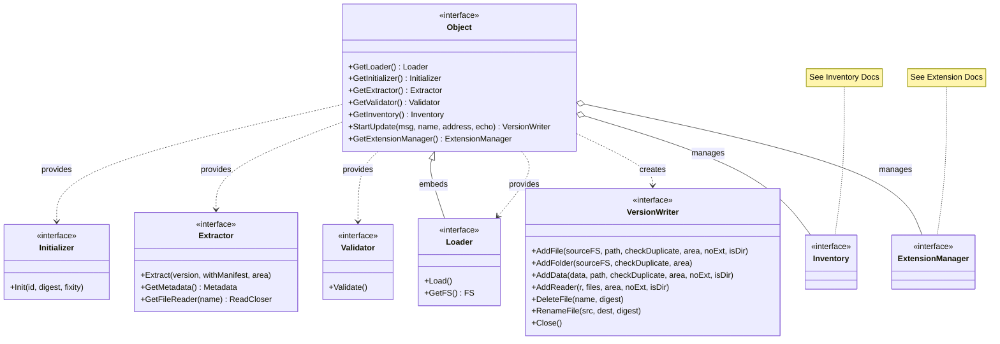

# Object Architecture

This document describes the architecture of the `pkg/ocfl/object` package. While the `inventory` package defines OCFL data structures, the `object` package implements the logic and orchestration of object operations.

## Class Diagram

The following diagram illustrates the `Object` interface, its specialized modules, and its relationship to the inventory.

## Component Overview

- **Object**: Central orchestrator and entry point for all operations.
- **Loader**: Loads existing objects. See [Load Sequence](load_sequence.md).
- **Initializer**: Creates new objects. See [Creation Sequence](create_sequence.md).
- **Extractor**: Accesses content and metadata.
- **VersionWriter**: Handles write operations and versioning. See [Update Sequence](update_sequence.md).
- **Validator**: Validates compliance with the OCFL specification.
- **ExtensionManager**: Manages object extensions. See [Extension Architecture](../../extension/docs/architecture.md).
- **Inventory**: Represents the OCFL state and metadata. See [Inventory Architecture](../../inventory/docs/architecture.md).

## Implementation Details

The `object` package uses the `inventory` package for state persistence. High-level structure is governed by the [Storage Root](../../storageroot/docs/architecture.md).
