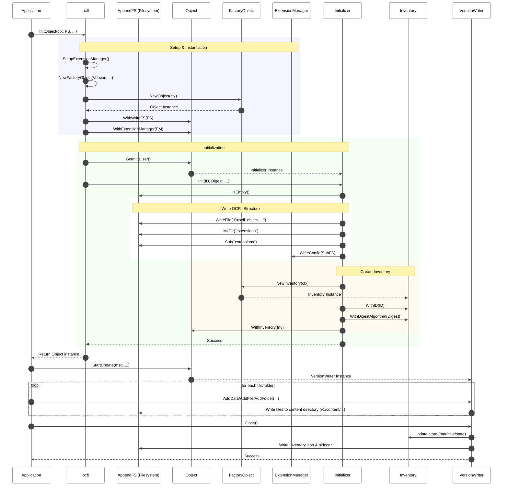

# Object Creation Sequence

This document outlines the sequence of operations for initializing a new OCFL Object. See the [Object Architecture](architecture.md) for structural details.

## Sequence Diagram

The following diagram illustrates the steps taken by `ocfl.InitObject()` and the internal `Initializer.Init()` method.

## Step Descriptions

1.  **Setup & Instantiation**: 
    *   The `ocfl` package configures the `ExtensionManager`.
    *   A version-specific `FactoryObject` creates the `Object` instance.
    *   The `Object` is associated with the writable filesystem and the `ExtensionManager`.
2.  **Initialization**:
    *   `Init()` is called on the `Initializer`.
    *   **Validation**: Verifies the target directory is empty.
    *   **Structure**: Writes the OCFL Namaste file and initializes the `extensions/` directory.
    *   **Inventory**: A new `Inventory` is created with the provided ID and digest algorithm.
3.  **Adding Files**:
    *   `StartUpdate()` provides a `VersionWriter`.
    *   Files and folders are added iteratively.
    *   `Close()` finalizes the version, updates the inventory, and writes the `inventory.json`.

## See Also
- [Object Architecture](architecture.md)
- [Object Load Sequence](load_sequence.md)
- [Object Initializer](INITIALIZER.md)
- [Version Writer](VERSION_WRITER.md)
