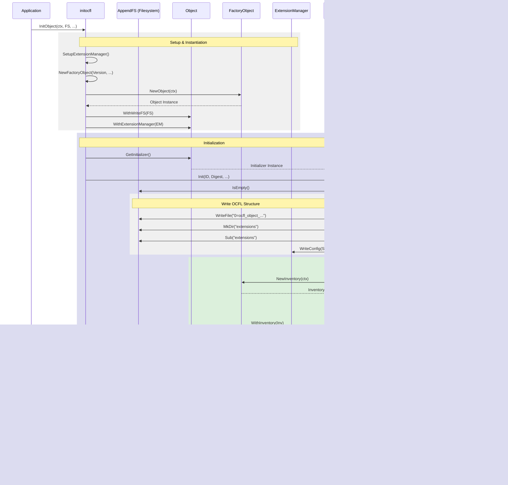

# Object Creation Sequence

This document describes the sequence of operations performed during the creation and initialization of a new OCFL Object. Detailed structural information can be found in the [**Object Architecture Documentation**](architecture.md).

## Sequence Diagram

The following diagram illustrates the steps taken by `initocfl.InitObject()` and the internal `Initializer.Init()` method, followed by adding the first files as seen in the examples.

## Description of Steps

1.  **Setup & Instantiation**: 
    *   The `initocfl` package sets up the `ExtensionManager` based on provided parameters.
    *   A `FactoryObject` for the desired OCFL version is used to create a new `Object` instance.
    *   The `Object` is configured with the writable filesystem and the `ExtensionManager`.
2.  **Initialization**:
    *   The `initocfl` package calls `Init()` on the `Object`'s `Initializer`.
    *   **Validation**: The `Initializer` verifies that the target directory is empty.
    *   **Write OCFL Structure**: It writes the OCFL object Namaste file (e.g., `0=ocfl_object_1.1`) and initializes the `extensions/` directory with configurations from the `ExtensionManager`.
    *   **Create Inventory**: A new, empty `Inventory` is created with the provided Object ID and digest algorithm, and associated with the `Object`.
3.  **Adding Files (Post-Initialization)**:
    *   To add content, the application calls `StartUpdate()`, which returns a `VersionWriter`.
    *   **File Upload Loop**: Multiple files or folders can be added iteratively using `AddData()`, `AddFile()`, or `AddFolder()`.
    *   Files are written directly to their destination in the version's content directory during the addition process.
    *   Closing the `VersionWriter` finalizes the version, updates the inventory (manifest and state), and writes the `inventory.json` and its sidecar file.

## See Also
- [**Object Architecture**](architecture.md)
- [**Object Load Sequence**](load_sequence.md)
- [**Object Initializer Documentation**](INITIALIZER.md)
- [**Version Writer Documentation**](VERSION_WRITER.md)
