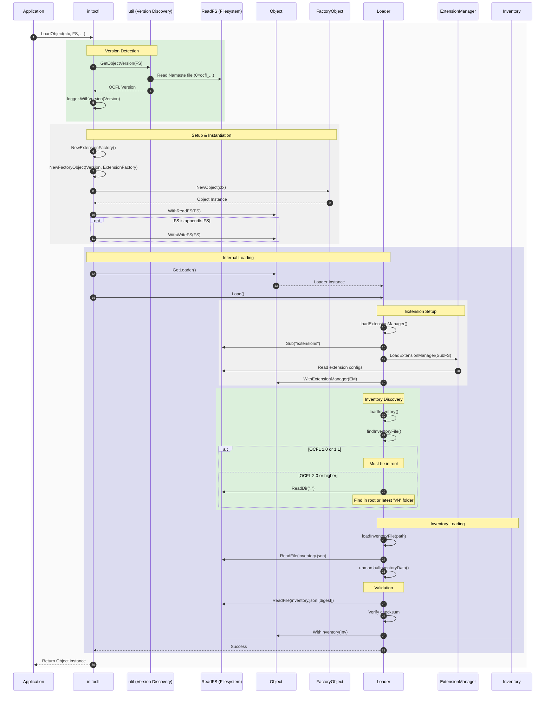

# Object Load Sequence

This document describes the sequence of operations for loading an existing OCFL Object. See the [Object Architecture](architecture.md) for structural details.

## Sequence Diagram

The following diagram illustrates the steps taken by `initocfl.LoadObject()` and the internal `Loader.Load()` method.

## Step Descriptions

1.  **Version Detection**: Identifies the OCFL version by reading the Namaste file (e.g., `0=ocfl_1.1`) via `util.GetObjectVersion()`.
2.  **Setup & Instantiation**: 
    *   An `ExtensionFactory` is created.
    *   A version-specific `FactoryObject` creates the `Object` instance.
    *   The `Object` is configured with the read-only and (if available) writable filesystems.
3.  **Internal Loading**:
    *   `Load()` is called on the `Loader`.
    *   **Extensions**: The `ExtensionManager` is initialized from the `extensions/` directory.
    *   **Inventory Discovery**: The `inventory.json` is located based on the OCFL version.
    *   **Inventory Loading**: The inventory is read, unmarshaled, and verified against its sidecar checksum.
4.  **Completion**: The fully loaded `Object` instance is returned.
