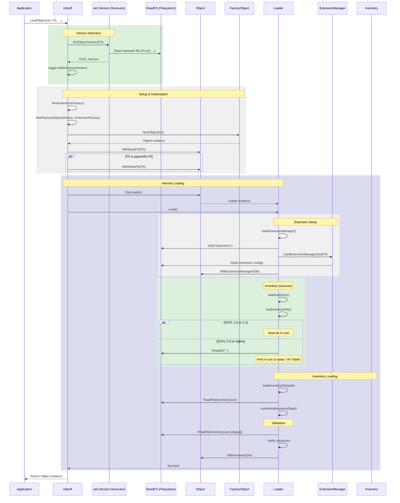

# Object Load Sequence

This document describes the sequence of operations performed during the loading of an existing OCFL Object, starting from the high-level entry point.

## Sequence Diagram

The following diagram illustrates the steps taken by `initocfl.LoadObject()` and the internal `Loader.Load()` method.

## Description of Steps

1.  **Version Detection**: The process begins by identifying the OCFL version of the object. This is done by reading the "Namaste" file (e.g., `0=ocfl_1.1`) in the object directory via `util.GetObjectVersion()`. The logger is also updated with this version.
2.  **Setup & Instantiation**: 
    *   An `ExtensionFactory` is created.
    *   The `FactoryObject` for the detected OCFL version is initialized and used to create a new `Object` instance.
    *   The `Object` is configured with the read-only filesystem and, if available, the writable filesystem.
3.  **Internal Loading**:
    *   The `initocfl` package calls `Load()` on the `Object`'s `Loader`.
    *   **Extension Setup**: The `Loader` initializes the `ExtensionManager` by reading configuration files from the `extensions/` directory.
    *   **Inventory Discovery**: The `Loader` identifies the location of the `inventory.json`. For OCFL 1.0 and 1.1, this file must be in the object root. For later versions, it may also search in the latest version directory.
    *   **Inventory Loading**: The `inventory.json` is read, unmarshaled, and its integrity is verified using the sidecar checksum file. Finally, the loaded `Inventory` is associated with the `Object`.
4.  **Completion**: The fully initialized and loaded `Object` instance is returned to the application.
