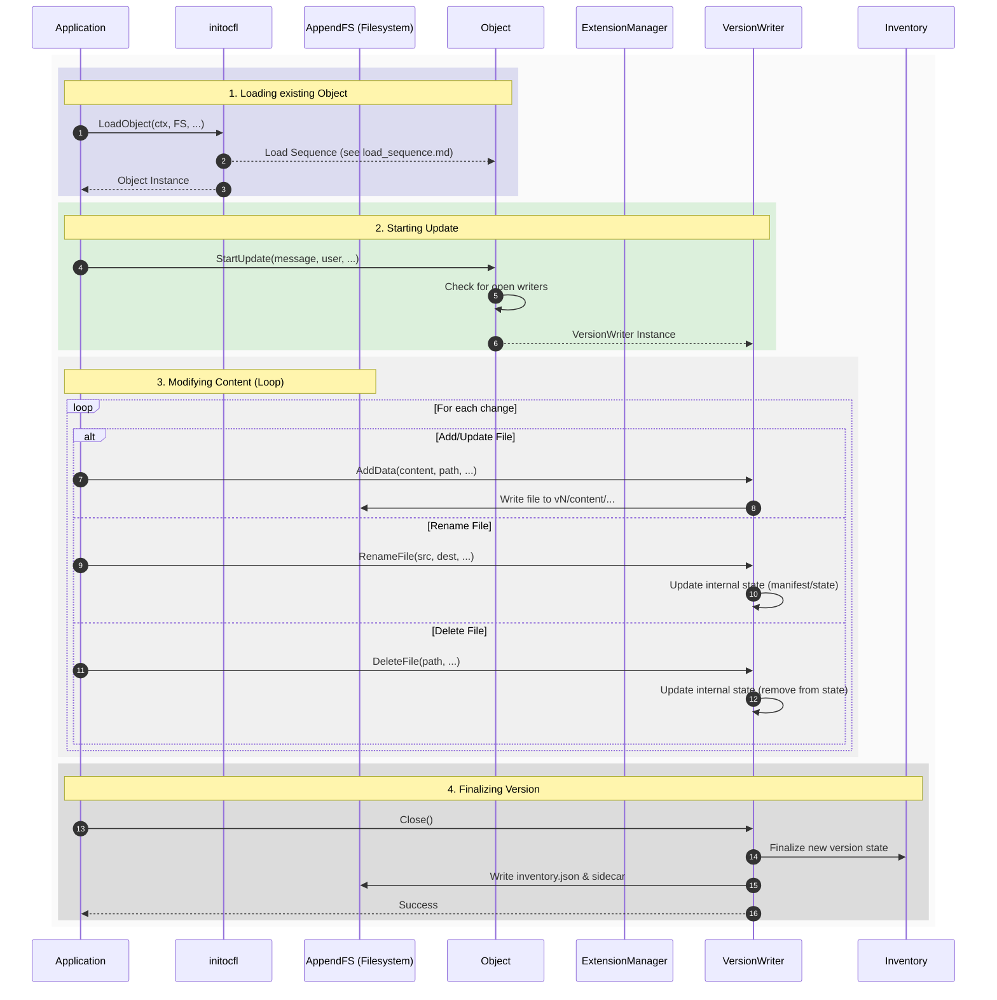

# Object Update Sequence

This document describes the sequence of operations for updating an existing OCFL Object. See the [Object Architecture](architecture.md) for structural details.

## Sequence Diagram

The following diagram illustrates the update process using the `VersionWriter`.

## Step Descriptions

1.  **Loading existing Object**: Detects the OCFL version and initializes the `ExtensionManager` and `Inventory`. See [Load Sequence](load_sequence.md).
2.  **Starting Update**: `StartUpdate()` is called with commit metadata, returning a `VersionWriter`.
3.  **Modifying Content**: 
    *   **Add/Update**: Data is written directly to the new version's content directory (`vN/content/...`).
    *   **Rename**: Internal state is updated to map the new logical path to the existing content digest.
    *   **Delete**: The logical path is removed from the new version's state.
4.  **Finalizing Version**: `Close()` commits changes, updates the `Inventory`, and writes the `inventory.json` and sidecar files.

## See Also
- [Object Architecture](architecture.md)
- [Object Load Sequence](load_sequence.md)
- [Object Creation Sequence](create_sequence.md)
- [Version Writer](VERSION_WRITER.md)
