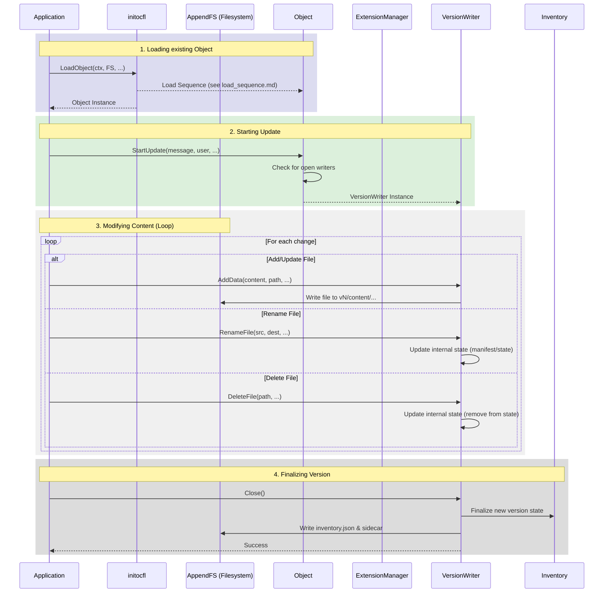

# Object Update Sequence

This document describes the sequence of operations performed during the update of an existing OCFL Object to a new version. Detailed structural information can be found in the [**Object Architecture Documentation**](architecture.md).

## Sequence Diagram

The following diagram illustrates the steps taken by `initocfl.LoadObject()` followed by the update operations using the `VersionWriter` as seen in `examples/object_upd/main.go`.

## Description of Steps

1.  **Loading existing Object**: 
    *   The process starts by loading the existing object. This involves detecting the OCFL version and initializing the `ExtensionManager` and `Inventory`. (Detailed in [Load Sequence](load_sequence.md)).
2.  **Starting Update**:
    *   The application calls `StartUpdate()` on the `Object` instance, providing metadata like the commit message and user information.
    *   A `VersionWriter` is returned, which is responsible for managing the changes in the new version.
3.  **Modifying Content**:
    *   **Add/Update**: New data is written directly into the content directory of the new version (`vN/content/...`).
    *   **Rename**: Renaming a file updates the internal state so that the logical path points to the existing (or new) content digest.
    *   **Delete**: Deleting a file removes its entry from the state of the new version (the content remains in previous version directories).
4.  **Finalizing Version**:
    *   `Close()` is called to commit all changes.
    *   The `Inventory` is updated with the new version information.
    *   The `inventory.json` and its sidecar file are written to the object root and the version directory.

## See Also
- [**Object Architecture**](architecture.md)
- [**Object Load Sequence**](load_sequence.md)
- [**Object Creation Sequence**](create_sequence.md)
- [**Version Writer Documentation**](VERSION_WRITER.md)
