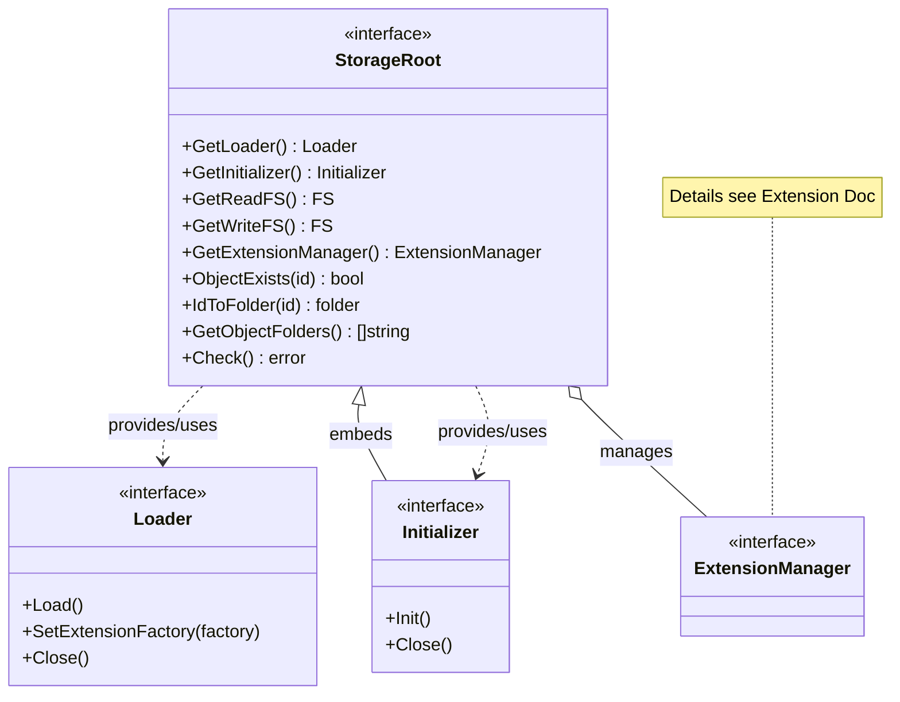

# Storage Root Architecture

This documentation describes the architecture of the interfaces in the `pkg/ocfl/storageroot` package. An OCFL Storage Root is the top level of an OCFL filesystem and contains OCFL objects as well as configuration-relevant information such as the Storage Layout.

## Class Diagram

The following diagram shows the central `StorageRoot` interface and its relationship to the functional components for loading, initializing, and managing extensions.

## Explanation of Components

- **StorageRoot**: The central interface for accessing an OCFL Storage Root. It allows navigating to objects, validating the root, and managing filesystems.
- **Loader**: Responsible for loading an existing Storage Root and its configuration (e.g., `ocfl_layout.json`). See [**Load Sequence**](load_sequence.md) for details.
- **Initializer**: Handles the initial creation of a Storage Root. See [**Initialization Sequence**](init_sequence.md) for details.
- **ExtensionManager**: Manages the extensions relevant to the Storage Root. Details can be found in the [**Extension Architecture Documentation**](../../extension/docs/architecture.md).

## Relationships to other packages

The Storage Root acts as a container for OCFL objects. While this package manages the structure of the root, the [`object` package](../../object/docs/architecture.md) takes over the logic for individual objects within the root.

Information on the data structure of the objects can be found in the [**Inventory Architecture Documentation**](../../inventory/docs/architecture.md).
