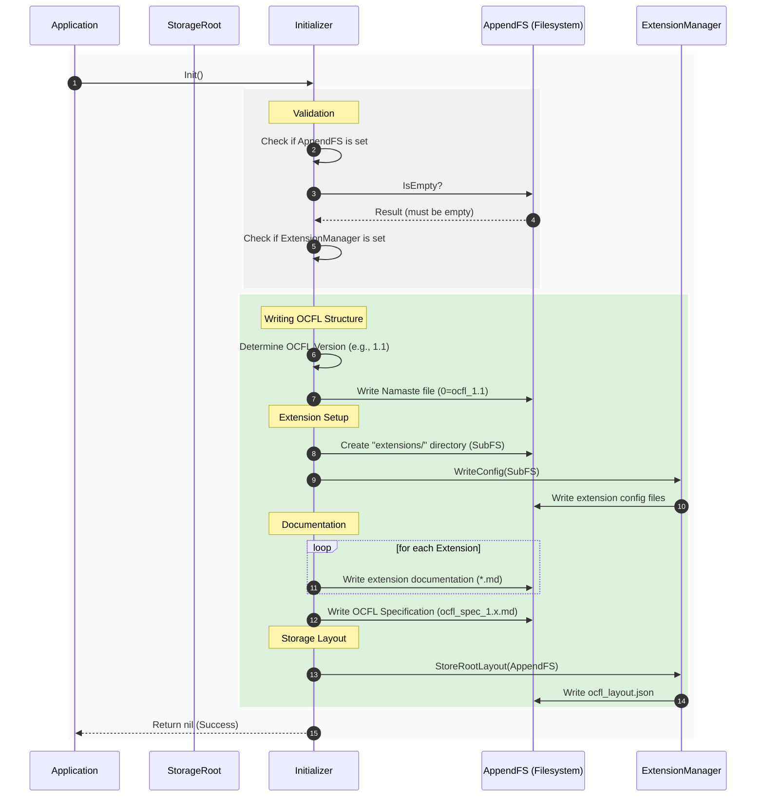

# Storage Root Initialization Sequence

This document describes the sequence of operations performed during the initialization of an OCFL Storage Root. Detailed structural information can be found in the [**Storage Root Architecture Documentation**](architecture.md).

## Sequence Diagram

The following diagram illustrates the steps taken by the `Initializer.Init()` method to set up a new Storage Root.

## Description of Steps

1.  **Validation**: Before any files are written, the `Initializer` ensures that a writable filesystem is available and that it is empty. It also verifies that an `ExtensionManager` is present.
2.  **Namaste File**: The first file written is the OCFL conformance declaration (Namaste file), which identifies the directory as an OCFL Storage Root and specifies its version.
3.  **Extensions**:
    *   A sub-filesystem for the `extensions/` directory is created.
    *   The `ExtensionManager` writes the configuration for all active extensions into this directory.
    *   The `Initializer` also writes documentation files for each extension if available.
4.  **Specification**: A copy of the OCFL specification corresponding to the root's version is written to the root directory.
5.  **Storage Layout**: Finally, the `ExtensionManager` is triggered to store the `ocfl_layout.json` (and any related mapping files), which defines how object IDs are mapped to physical paths within the Storage Root.
