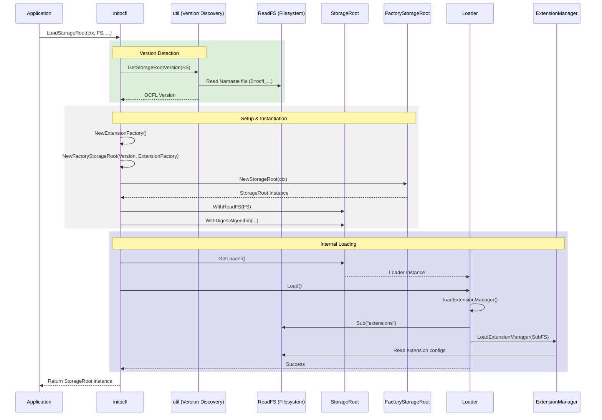

# Storage Root Load Sequence

This document describes the sequence of operations performed during the loading of an existing OCFL Storage Root, starting from the high-level entry point.

## Sequence Diagram

The following diagram illustrates the steps taken by `initocfl.LoadStorageRoot()` and the internal `Loader.Load()` method.

## Description of Steps

1.  **Version Detection**: The process begins by identifying the OCFL version of the Storage Root. This is done by reading the "Namaste" file (e.g., `0=ocfl_1.1`) in the root directory via `util.GetStorageRootVersion()`.
2.  **Setup & Instantiation**: 
    *   An `ExtensionFactory` is created.
    *   The `FactoryStorageRoot` for the detected OCFL version is initialized and used to create a new `StorageRoot` instance.
    *   The `StorageRoot` is configured with the filesystem and default digest algorithm.
3.  **Internal Loading**: 
    *   The `initocfl` package calls `Load()` on the `StorageRoot`'s `Loader`.
    *   The `Loader` identifies the `extensions/` directory and uses the `ExtensionFactory` to load and initialize the `ExtensionManager` with the configuration files found on disk.
4.  **Completion**: The fully initialized and loaded `StorageRoot` instance is returned to the application.
